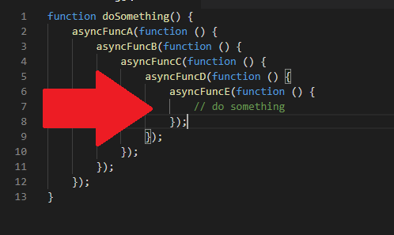

Promises are a fundamental building block in almost every javascript application. Even with the emergence of modern syntax like async/await, understanding the workings of promises is the key to writing async code effectively.

I believe the most confusing part, and the most important to understand, is the promise's `then` method. It is the main and most basic way of interacting with a promise.

In this article, I'll try taking a different, more functional, approach to explain how the `then` method actually works. Hopefully, by the end of this article, you will feel more confident using promises and have a better understanding of them.

We will begin with the assumption that you already know what Promises are and you're only here to develop a better understanding of how to manipulate them. With that said, let's jump right into talking about our main tool for interacting and manipulating promises, the `then` method.

***

### Registering a Callback
The first thing we will learn about the `then` method, is that it is a way of registering a callback (function) to execute once the promise is resolved:
```
let showSpinner = false;
let movies = [];

function load() {
  showSpinner = true;

  function onMoviesLoaded(response) {
    movies = response.data;
    showSpinner = false;
  }

  const fetchMoviesPromise = fetchMovies();

  fetchMoviesPromise.then(onMoviesLoaded);
}
```

In this example, we call the function `fetchMovies` which makes a request to our API in order to get a list of movies to display. Since it is a long operation, it will be done asynchronously in order not to block the javascript's main thread. A Promise is returned from making this call. The Promise is simply an object, we keep the reference to it in the variable `fetchMoviesPromise`.

We use the variable `showSpinner` to control the visibility of a spinner that indicates whether a background process is in progress. We set it to true before making the call to `fetchMovies` to trigger the spinner. If we'd set it to false right after the call to `fetchMovies`, it will not show the spinner at all.

The function `onMoviesLoaded` is responsible for updating the spinner's state. We pass it to the `then` method, it will fire when the Promise resolves.

`onMoviesLoaded` also gets access to the result of our API request, it is passed as a parameter. This is how we are able to access the movies list returned in the response, and save it to the variable `movies` used by our UI to display the actual content.

### A Cold Day in Hell
You might have heard that Promises are meant to solve the dreaded "callback hell" or "indentation hell". In order to understand that, let's consider a more complicated use case.

In this scenario, we want to display data about a movie that the user has purchased a ticket for.

It is a two steps process:
1. We'll use an API endpoint to get the ticket data by the ticket's id.
2. We will use the `movieId` in the ticket's properties to query the movies API to show more details about the movie.

A naive implementation using Promises would like something like this:
```
let ticketData = {};
let movieData = {};

function load(ticketId) {
	fetchTicketById(ticketId).then(function (fetchTicketResponse) {
		ticketData = fetchTicketResponse.data;

		fetchMovieById(ticketData.movieId).then(function (fetchMovieResponse) {
			movieData = fetchMovieResponse.data;
    });
  });
}
```

The code is very verbose and looks like an ugly arrow. Imagine what will happen with a sequence of 5 or more!


Let's see how using promises will solve this problem.

### Then as a Map
Up until now, we thought of `then` as a way to register a callback to be executed once the async operation is done.

I'm going to layout a different way to think about the `then` method. I will explain it through the example of solving indentation hell.

I propose to think of the `then` method, as the promise's `map` method.

To understand what I mean, let's look at how `map` works with a more familiar construct:
```
const double = x => x * 2;
const input = [1, 2, 3, 4, 5];

const output = input.map(double);

console.log(input, output);
```

The `map` function receives as a parameter what we call a projection function. In code snippet #3 we start by defining our projection function, `double`. `double` receives a number and returns its multiplication by 2.

`map` goes over the original input array. It passes every member to the given projection function and returns a new array with all the results. The original input stays intact, hence the console output of snippet #3:
```
[1, 2, 3, 4, 5] [2, 4, 6, 8, 10]
```

Let's generalize this idea (without using scary terms like functors or monads). An array is a wrapper to a series of values. The `map` method allows us to take a function meant to be used on a simple value, and run it in the context of that wrapper. The result is a new wrapper of the same type, but with values created by our projection function.


#### Array? But you said Promise!
You might have already guessed it, but there are many types of wrappers besides array. A Promise is one such wrapper.

A Promise is a bit special since it doesn't have a proper `map` method. Rather its `then` method behaves much like the `map` method. Let's see it in practice:
```
const getUserName = user => user.name;

const fetchCurrentUserPromise = fetchCurrentUser();
const fetchCurrentUserNamePromise = fetchCurrentUserPromise.then(getUserName);

fetchCurrentUserPromise.then(function (user) {
	console.log(user);
});

fetchCurrentUserNamePromise.then(function (userName) {
	console.log(userName);
});
```

Let's go over snippet #4 line by line and make sense of it.

We start by defining our projection function, `getUserName`, which gets a user object and returns its `name` property.

We call `fetchCurrentUser`, which is an async function, so it returns a promise which we keep reference to in `fetchCurrentUserPromise`.

Then we call the `then` method on `fetchCurrentUserPromise`, passing our projection function. This line does not execute our projection function.

A new promise is returned from this call which we keep a reference to in `fetchCurrentUserNamePromise`. This new promise will be resolved when the original promise is resolved. Its value would be the result of the projection function.

We finish by calling `then` again, on both promises. This time, we pass anonymous functions, to log the results of both promises once resolved.

Though pretty cool, you're probably still wondering how does this solve our problem? In the next section we'll see the solution to a surprisingly similar problem with arrays using `map`, then apply it to promises.

### Then as a Flat Map
Let's look at the following function:
```
const repeat = x => [x, x];

console.log(repeat(1));
```

Looks simple enough, the `repeat` function takes a value and "repeats" it, i.e returns an array containing it twice. The output is of course:
```
[1, 1]
```

Is it possible to reuse this function to repeat a whole array? Meaning, for the following input:
```
[1, 2, 3, 4, 5]
```

I would expect the following output:
```
[1, 1, 2, 2, 3, 3, 4, 4, 5, 5]
```

Obviously just passing an array to this function would not return the desired output… However, `repeat` does look like a projection function! When we pass it to `map` we almost get what we're looking for:
```
const input = [1, 2, 3, 4, 5];
const result = input.map(repeat);

console.log(result);
```

```
[[1, 1], [2, 2], [3, 3], [4, 4], [5, 5]]
```

Concatenating all the inner arrays into 1 big array, would give us our desired result:
```
console.log([
  ...result[0],
  ...result[1],
  ...result[2],
  ...result[3],
  ...result[4]
]);
```

We could also write a general utility function to concat array of arrays, but it turns out we don't have to! This is called flattening and all we have to do is call the `flat` function to do it:
```
const input = [1, 2, 3, 4, 5];
const result = input.map(repeat).flat();

console.log(result);
```

The `flat` function returns a new array, which is the result of concatenating all the values inside the original array. Mapping and flattening go so well together, we can do them both at once, using `flatMap`:
```
const input = [1, 2, 3, 4, 5];
const result = input.flatMap(repeat);

console.log(result);
```

Code snippets #7 and #8 are equivalent. Both have the same output and as you probably guessed, `flatMap` calls `map` with the provided projection function and then `flat`.

Flattening basically means getting rid of the outer wrapper. It is worth noting that flattening works only when the inner and outer wrappers' types are the same. We can't flatten an array of promises for example.

Now we should have all the tools to solve our original problem, loading a ticket by id and then loading the movie related to said ticket:
```
let ticketData = {};
let movieData = {};

function load(ticketId) {
	const fetchTicketPromise = fetchTicketById(ticketId);
	const fetchMoviePromise = fetchTicketPromise
		.then(response => response.data.movieId)
		.then(fetchMovieById);

	fetchTicketPromise.then(function (response) {
		ticketData = response.data;
	});

	fetchMoviePromise.then(???);
}
```

Let's summarize what happens in code snippet #9:

`fetchTicketPromise` is resolved once the API call to get the ticket is done.

`fetchMoviePromise` is the product of calling `then` twice on `fetchTicketPromise`:
1. Extract the movieId (line #7). Resolves with the movieId
2. Call `fetchMovieById` that makes an API call and returns a promise

`fetchMoviePromise` is a promise of the result from the call to `fetchMovieById`, which by itself returns a promise. So is it a promise of a promise??

It turns out, it isn't!

`fetchMoviePromise` is actually just a promise of the response from the call to the movies API. The complete code snippet looks like this:
```
let ticketData = {};
let movieData = {};

function load(ticketId) {
	const fetchTicketPromise = fetchTicketById(ticketId);
	const fetchMoviePromise = fetchTicketPromise
		.then(response => response.data.movieId)
		.then(fetchMovieById);

	fetchTicketPromise.then(function (response) {
		ticketData = response.data;
	});

	fetchMoviePromise.then(function (response) {
		movieData = response.data;
	});
}
```

Since we learned `then` is basically the promise's `map` method, you would expect `fetchMoviePromise` to be a promise of a promise. So you might ask "can I get rid of the outer promise like we flattened the array of arrays?".

As you can see in the code snippet #10, I didn't do any extra work to flatten this promise. This is thanks to `then` being not only the promise's `map` method, but also the `flatMap` method! If the result of the projection function passed to `then` is a promise, it is automatically flattened.

Finally, we get the nice flat code we always dreamed of. And we can chain as many async functions as we'd like using `then`. They would all be flattened and we'll always have a simple promise at hand:
```
asyncFuncA()
  .then(asyncFuncB)
  .then(asyncFuncC)
  .then(asyncFuncD)
  .then(asyncFuncE)
  .then(function (resultOfFuncE) {
    // do whatever
  });
```

### Mix and Match
In code snippet #10, every call to `then` had one job only. In line 7 it is used as `map`, in line 8 as `flatMap` and in lines 10 and 14 as a way to register a callback. I find assigning 1 behavior to every call to `then` very clear, especially when learning like we do here.

More often than not, you'll see different behaviors of `then` mixed into one call. The same code written in snippet #10 could be written as follows:
```
let ticketData = {};
let movieData = {};

function load(ticketId) {
	fetchTicketById(ticketId).then(function (response) {
		ticketData = response.data;

		return fetchMovieById(ticketData.movieId);
	}).then(function (response) {
		movieData = response.data;
	});
}
```

While it makes it difficult to understand how `then` really works, you can argue this code snippet tells a better story. "Fetch the ticket by its id, then save its data into a variable and continue by fetching the movie by its id. Then, save the movie's data in a variable."

I find both styles valid ways of writing code and using promises. In my opinion there are only 2 factors to decide which style to use:
1. Better fit to context - if one style results in a significantly clearer code over the other, use it!
2. Organizational standards - if one style is more common than the other among your co-workers or in general in the code base, use it over the other.

### Parting words
On the surface, promises seem to fail to deliver on their promise (no pun intended): just another way to nest callbacks until the unavoidable indentation hell. It is only after truly understanding the workings of `then` that the elegance of promises emerges.

Basically, `then` is used for 3 things:
1. Registering good ol' callbacks
2. Mapping over promises
3. Flat mapping promises

The ideas of mapping and flattening are not unique to promises. We can generalize and transfer our understanding and workings of these concepts to other structures, just like we did with an array.

This is only the beginning of your promise journey. But really understanding what `then` is doing, will make your life easier and make sense of promise error handling, `Promise.all`, `async/await` etc. This was basically the hard part, congratulations!

*Thanks to Yonatan Kra and Minor Ben-David for reviewing and editing.*